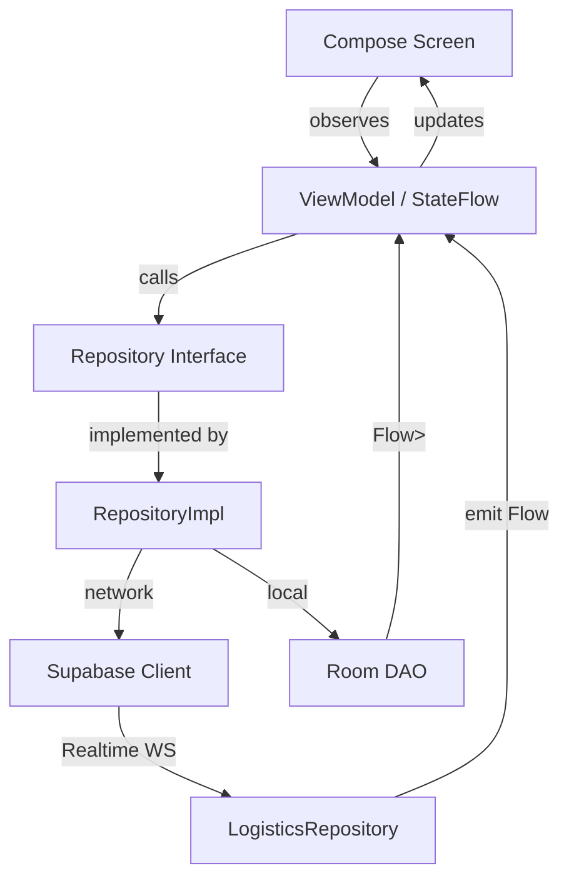

# DaisukeFoddlock 1.0 — Campus Food Delivery & Order Management System

<div align="center">


-informational?style=for-the-badge)


<br/>

> **A modern, dual-role native Android application for university campus food ecosystems.**
> Built with Jetpack Compose, Supabase, and a fully offline-first local Room cache.
> Designed specifically for the **UNS Campus** layout — featuring real canteen locations like *Kantin FMIPA* and *Lobi FATISDA*.

</div>

---

## 📖 Table of Contents

- [Overview](#-overview)
- [Technology Stack](#️-technology-stack--architecture)
- [Core Features](#-core-features)
  - [Customer App Flow](#1-customer-app-flow)
  - [Merchant App Flow](#2-merchant-app-flow)
- [Architecture & Data Flow](#-architecture--data-flow-diagrams)
  - [Customer Ordering Workflow](#customer-ordering--status-tracking-workflow)
  - [Merchant Management Workflow](#merchant-order-management-workflow)
- [Project Structure](#-project-directory-structure)
- [Database Schemas](#-database-schemas)
  - [Local SQLite (Room)](#1-local-sqlite-database-room---orders-table)
  - [Supabase PostgreSQL](#2-supabase-postgresql-schema---orders-table)
- [Setup & Installation](#-setup--installation)
- [Supabase RLS Configuration](#-supabase-rls-configuration)
- [Navigation Graph](#-navigation-graph)
- [Payment Gateway Reference](#-payment-gateway-reference)
- [Menu Catalog Reference](#-menu-catalog-reference)
- [Contributing Guidelines](#-contributing-guidelines)
- [License](#-license)

---

## 🌐 Overview

**DaisukeFoddlock** is a full-featured campus food delivery and order management platform targeting Android devices within a university environment. The application supports **two distinct user roles** — *Customer* and *Merchant* — each with a dedicated, purpose-built interface.

The app adopts an **offline-first strategy**: all order transactions are cached locally in a Room SQLite database before being synchronized with the cloud-hosted Supabase backend. This ensures a consistent and responsive experience regardless of network conditions.

Key design decisions include:

- **Declarative UI** via Jetpack Compose with Material 3, enabling a reactive and composable screen hierarchy.
- **Supabase Realtime** WebSocket listeners for instant push-style merchant notifications without polling overhead.
- **Hilt-powered DI** ensuring clean separation between repository, viewmodel, and UI layers.
- **DataStore Preferences** for lightweight, type-safe user session and role persistence.

---

## 🛠️ Technology Stack & Architecture

| Layer | Technology | Purpose |
| :--- | :--- | :--- |
| **UI Framework** | Jetpack Compose + Material 3 | Declarative, reactive UI rendering |
| **Language** | Kotlin (Coroutines + Flows) | Asynchronous, null-safe development |
| **Dependency Injection** | Dagger Hilt | Modular and testable dependency graph |
| **Local Cache** | Room Persistence Library (SQLite ORM) | Offline-first order history & receipt storage |
| **Remote Backend** | Supabase (GoTrue + Postgrest + Realtime) | Auth, database, and live event streaming |
| **State Management** | MVVM with `ViewModel` + `MutableStateFlow` | Lifecycle-aware reactive state management |
| **Session Storage** | Jetpack DataStore (Preferences) | Persistent role and user session mapping |
| **Navigation** | Jetpack Navigation Compose | Single-activity navigation graph |
| **Build System** | Gradle (Version Catalogs via `libs.versions.toml`) | Centralized, versioned dependency management |

### Supabase SDK Modules Used

| Module | Function |
| :--- | :--- |
| **GoTrue** | Secure user registration, login, and session token persistence |
| **Postgrest** | RESTful, type-safe PostgreSQL CRUD operations |
| **Realtime** | WebSocket-based Postgres change event streaming |

---

## 🌟 Core Features

The application delivers a dual-mode experience through a shared navigation graph, routing users based on their registered role at login.

---

### 1. Customer App Flow

#### 🔐 Authentication
- Account registration and login with automatic session management via Supabase GoTrue.
- Role selection (`CUSTOMER` / `MERCHANT`) persisted locally via DataStore Preferences, surviving app restarts.
- Secure token refresh handled transparently by the Supabase Kotlin client.

#### 🍔 Menu Catalog
A curated selection of campus meals served through a dynamic, scrollable grid:

| Category | Items |
| :---: | :--- |
| **Mains** | Lasagna, Ramen, Samyang, Katsu, Kebab |
| **Snacks** | Onigiri, Pangsit, Sandwich |
| **Sweets** | Mochi, Dorayaki |

#### 🧂 Food Customization
Each menu item supports multi-dimensional configuration before adding to cart:

- **Portion Size**: `REGULAR` or `LARGE`
- **Spice Level**: Continuous slider from `0.0` (no spice) to `5.0` (extra hot)
- **Toppings** (category-specific):
  - *Savory items*: Egg, Sausage, Cheese, Mushroom
  - *Sweet items*: Matcha Powder, Ice Cream, Choco Chips, Honey
- **Additional Notes**: Free-text field for special preparation requests

#### 🎟️ Promo Vouchers
Discount code system with server-side minimum order validation:

| Voucher Code | Type | Minimum Order |
| :--- | :--- | :--- |
| `HEMAT10` | Percentage Discount | Varies |
| `SPESIAL WEEKEND` | Weekend Promo | Varies |
| `MEMBER VIP` | Loyalty Discount | Varies |

Invalid or below-minimum vouchers are rejected client-side before submission.

#### 🛵 Flexible Delivery Options
- **Delivery Mode**: Configurable campus drop-off address with predefined location options (e.g., Kantin FMIPA, Lobi FATISDA).
- **Takeaway Mode**: Self-pickup, no address required.

#### 💳 Checkout & Payment Selection
A multi-gateway payment selection screen supports:

| Category | Options |
| :--- | :--- |
| **E-Wallets** | GoPay, OVO, DANA, ShopeePay |
| **Instant** | QRIS |
| **Bank Transfer** | BCA Virtual Account, Mandiri Virtual Account, BNI Virtual Account, BRI Virtual Account |

#### 🔄 Hybrid Sync & Order Processing
- Orders are submitted to **Supabase PostgreSQL** for merchant processing.
- Simultaneously, a local `OrderEntity` record is written to **Room DB** as an immutable receipt.
- If the Supabase request fails or times out, a local UUID is generated as a fallback transaction ID, ensuring the local record is always created.

#### 📍 Real-time Delivery Tracking
- Active order status is displayed in a persistent top banner (`LogisticsInfoBanner`).
- Status polling occurs every **5 seconds** via REST against the Supabase `orders` table.
- Status lifecycle: `PENDING` ➡️ `PREPARING` ➡️ `IN_TRANSIT` ➡️ `DELIVERED`
- A synchronized countdown timer reflects the estimated remaining delivery duration.

#### 🗓️ Order History
- Complete local transaction history rendered from the Room database.
- Each entry shows food name, quantity, toppings, payment method, price, and fulfillment status.
- Fully offline — no network required to browse past orders.

---

### 2. Merchant App Flow

#### 📋 Live Order Queue Dashboard
- The merchant dashboard streams all active campus orders in real-time via **Supabase Postgres Realtime** WebSocket listeners.
- On receiving a Realtime `INSERT` broadcast, the ViewModel triggers a silent REST reload to ensure UI consistency and avoid stale data from incomplete Realtime payloads.

#### ✅ Order Fulfillment Control
Merchants can progress any order through the fulfillment pipeline with a single tap:

```
PENDING ──► PROCESSING ──► COMPLETED
```

Each status change fires a `PATCH` request to Supabase, which triggers the Realtime update propagated to the customer's polling listener.

#### 🔔 Push Notifications
- A custom `NotificationHelper` wraps the Android `NotificationManager` to issue local push alerts when new orders arrive.
- Notification includes order summary, customer name, and delivery type.

#### 🖥️ Flicker-Free Silent Syncing
- Realtime events trigger a background REST reload rather than directly mutating UI state, preventing visible screen flicker during list updates.
- UI state is only updated once the reload completes, maintaining a stable visual experience during high-throughput order periods.

---

## 📐 Architecture & Data Flow Diagrams

### Customer Ordering & Status Tracking Workflow

```mermaid
sequenceDiagram
    autonumber
    actor Customer as Compose UI (Customer)
    participant VM as SharedOrderViewModel
    database Room as Local Room DB
    database Remote as Supabase Server
    participant Logistics as LogisticsRepository
    
    Note over Customer,Remote: Phase 1 — Cart Checkout & Confirmation
    Customer->>VM: confirmOrder(paymentMethod)
    activate VM
    VM->>Remote: POST /rest/v1/orders (Insert Order & Items)
    alt Supabase Success
        Remote-->>VM: 201 Created (ID: TX-12345)
    else Supabase Timeout / Network Failure
        VM->>VM: Fallback — Generate Local UUID
    end
    
    VM->>Room: insertOrder(OrderEntity)
    VM->>VM: clearCart()
    VM-->>Customer: Navigate to PaymentSuccessScreen
    deactivate VM
    
    Note over Customer,Remote: Phase 2 — Real-time Status Syncing & Polling
    VM->>Logistics: startCountdown() & startStatusPolling(orderId)
    loop Every 5 Seconds
        Logistics->>Remote: GET /rest/v1/orders?id=eq.TX-12345
        Remote-->>Logistics: { status: "PROCESSING" }
        Logistics-->>Customer: Update Tracker Banner (IN_TRANSIT + Countdown)
    end

    Note over Customer,Remote: Phase 3 — Delivery Completion
    Remote-->>Logistics: { status: "DELIVERED" }
    Logistics->>VM: stopPolling()
    VM-->>Customer: Show Delivered State — Dismiss Banner
```

---

### Merchant Order Management Workflow

```mermaid
sequenceDiagram
    autonumber
    actor Merchant as Compose UI (Merchant)
    participant VM as MerchantViewModel
    database Remote as Supabase Server
    participant Push as NotificationHelper
    
    Note over Merchant,Remote: Phase 1 — Real-time Order Monitoring
    VM->>Remote: Subscribe to Postgres Realtime (Table: orders, Event: INSERT)
    Remote-->>VM: Realtime INSERT Broadcast (new order received)
    VM->>Remote: GET /rest/v1/orders (Silent Background Reload)
    Remote-->>VM: Updated Order Queue
    VM->>Push: showOrderNotification("Pesanan Baru!", orderSummary)
    Push-->>Merchant: Android Local Push Notification
    VM-->>Merchant: Render Updated Order List (no flicker)
    
    Note over Merchant,Remote: Phase 2 — Order Fulfillment Progression
    Merchant->>VM: updateOrderStatus(orderId, "PROCESSING")
    VM->>Remote: PATCH /rest/v1/orders?id=eq.{orderId} (status="PROCESSING")
    Remote-->>VM: 200 OK
    VM->>VM: reloadOrdersSilently()
    VM-->>Merchant: Refresh UI Queue
    
    Merchant->>VM: updateOrderStatus(orderId, "COMPLETED")
    VM->>Remote: PATCH /rest/v1/orders?id=eq.{orderId} (status="COMPLETED")
    Remote-->>VM: 200 OK
    VM->>VM: reloadOrdersSilently()
    VM-->>Merchant: Remove Completed Order from Active Queue
```

---

### State Management & Repository Layer



---

## 📁 Project Directory Structure

```text
app/src/main/java/com/example/daisukefoddlock10/
│
├── DaisukeApplication.kt               # Hilt Application class — DI graph root
├── MainActivity.kt                     # Single-Activity entry point, NavHost + Theme setup
├── Utils.kt                            # Global utility functions (currency, timestamp formatting)
│
├── data/
│   ├── local/
│   │   ├── dao/
│   │   │   └── OrderDao.kt             # Room DAO — CRUD operations for local order cache
│   │   ├── entity/
│   │   │   └── OrderEntity.kt          # Room DB entity mapping to SQLite `orders` table
│   │   ├── AppDatabase.kt              # RoomDatabase class, version management
│   │   └── SessionManager.kt          # DataStore Preferences wrapper for session/role state
│   │
│   ├── model/
│   │   ├── CartItem.kt                 # In-memory cart item data class
│   │   ├── FoodItem.kt                 # Menu catalog item model (name, category, base price)
│   │   ├── LogisticsModels.kt          # Delivery node definitions and status enumerations
│   │   ├── OrderHistory.kt             # UI-layer model aggregating order display data
│   │   ├── OrderResponse.kt            # Supabase API request/response payload models
│   │   ├── PaymentMethod.kt            # Supported payment processor configurations
│   │   ├── PromoVoucher.kt             # Discount voucher definitions with validation rules
│   │   ├── UserRole.kt                 # Enum: CUSTOMER | MERCHANT
│   │   └── UserSession.kt              # Active user profile session data class
│   │
│   └── repository/
│       ├── AuthRepository.kt           # Auth interface contract (login, logout, register)
│       ├── AuthRepositoryImpl.kt       # Supabase GoTrue-backed implementation
│       ├── LogisticsRepository.kt      # Realtime channel + polling for order status updates
│       └── OrderRepository.kt          # Supabase Postgrest order submission and PATCH interface
│
├── di/
│   ├── DatabaseModule.kt               # Hilt module: Room DB + SessionManager bindings
│   ├── RepositoryModule.kt             # Hilt module: binds interfaces to implementations
│   └── SupabaseModule.kt              # Hilt module: SupabaseClient singleton (Auth, Postgrest, Realtime)
│
├── navigation/
│   └── AppNavGraph.kt                  # NavHost graph — routes based on role and auth state
│
├── ui/
│   ├── components/
│   │   ├── LogisticsInfoBanner.kt      # Persistent top banner for active delivery tracking
│   │   ├── OptionSelectors.kt          # Topping toggles, size selector, spice level slider
│   │   └── ProductHeader.kt            # Food item header card (image, name, price, description)
│   │
│   ├── screens/
│   │   ├── SharedOrderViewModel.kt     # Central customer order pipeline ViewModel (Hilt-scoped)
│   │   │
│   │   ├── auth/
│   │   │   ├── AuthViewModel.kt        # Handles login/register state, role dispatch
│   │   │   └── LoginScreen.kt          # Role selector + credential input UI
│   │   │
│   │   ├── checkout/
│   │   │   └── CheckoutScreen.kt       # Cart summary, delivery config, voucher input
│   │   │
│   │   ├── history/
│   │   │   └── OrderHistoryScreen.kt   # Local receipt list from Room DB (offline capable)
│   │   │
│   │   ├── merchant/
│   │   │   ├── MerchantViewModel.kt    # Realtime queue management + status update logic
│   │   │   └── MerchantDashboardScreen.kt  # Canteen order management console
│   │   │
│   │   ├── order/
│   │   │   └── OrderScreen.kt          # Main menu grid catalog + sliding cart panel
│   │   │
│   │   ├── payment/
│   │   │   ├── PaymentScreen.kt        # Gateway selection grid + order confirmation
│   │   │   └── PaymentSuccessScreen.kt # Post-payment receipt summary + tracking entry point
│   │   │
│   │   └── theme/
│   │       ├── Color.kt                # Brand color palette tokens
│   │       ├── Theme.kt                # Material 3 theme definitions (light/dark)
│   │       └── Type.kt                 # Typography scale configuration
│   │
│   └── util/
│       └── NotificationHelper.kt       # Android NotificationManager wrapper for push alerts
```

---

## 💾 Database Schemas

### 1. Local SQLite Database (Room) — `orders` Table

Stores immutable transaction receipts on-device for offline order history browsing. Records are written immediately after checkout and are never modified post-creation.

| Column | Type | Constraints | Description |
| :--- | :--- | :--- | :--- |
| `id` | `INTEGER` | `PRIMARY KEY AUTOINCREMENT` | Internal SQLite row identifier |
| `transactionId` | `TEXT` | `NOT NULL` | Shared reference ID from Supabase (or local UUID fallback) |
| `foodName` | `TEXT` | `NOT NULL` | Display name of the ordered item |
| `quantity` | `INTEGER` | `NOT NULL` | Number of units ordered |
| `price` | `REAL` | `NOT NULL` | Final computed price for item + customizations |
| `size` | `TEXT` | `NOT NULL` | Portion size: `REGULAR` or `LARGE` |
| `toppings` | `TEXT` | `NULLABLE` | Comma-separated list of selected toppings |
| `notes` | `TEXT` | `NULLABLE` | Special preparation notes from customer |
| `paymentMethod` | `TEXT` | `NOT NULL` | Selected payment channel (e.g., `GoPay`, `Transfer BCA`) |
| `status` | `TEXT` | `NOT NULL` | Fulfillment status snapshot: `CONFIRMED`, `COMPLETED`, etc. |
| `timestamp` | `INTEGER` | `NOT NULL` | Unix epoch timestamp in milliseconds at order creation |

> **Note:** The Room schema stores one row per `CartItem` within an order, meaning a single transaction with 3 items will produce 3 rows sharing the same `transactionId`. The `OrderHistoryScreen` groups rows by `transactionId` for display.

---

### 2. Supabase PostgreSQL Schema — `orders` Table

The central backend table powering the merchant queue, customer status polling, and Realtime event broadcasting.

```sql
-- Enable UUID extension if not already enabled
create extension if not exists "pgcrypto";

create table public.orders (
  id              text        not null default gen_random_uuid(),
  created_at      timestamptz not null default timezone('utc', now()),
  total_price     integer     not null,
  status          text        not null default 'PENDING',
  is_delivery     boolean     not null default false,
  is_takeaway     boolean     not null default false,
  delivery_address text       null,
  notes           text        null,
  items           jsonb       not null default '[]'::jsonb,

  constraint orders_pkey primary key (id),
  constraint orders_status_check check (
    status in ('PENDING', 'PROCESSING', 'COMPLETED', 'CANCELLED')
  )
);

-- Enable Realtime for merchant dashboard live updates
alter publication supabase_realtime add table public.orders;
```

#### `items` JSONB Structure

Each element in the `items` array represents one configured cart item:

```json
{
  "food_id": "onigiri_001",
  "food_name": "Onigiri",
  "quantity": 2,
  "size": "REGULAR",
  "toppings": ["Egg", "Cheese"],
  "spicy_level": 2.5,
  "item_total_price": 32000
}
```

> Using a `jsonb` column for items avoids complex relational joins while preserving the full checkout configuration per order. This trades normalization for query simplicity, which is appropriate for a campus-scale deployment.

---

## 🚀 Setup & Installation

### Prerequisites

Before building, ensure your development environment meets the following requirements:

| Requirement | Version |
| :--- | :--- |
| Android Studio | Ladybug (2024.2.1) or newer |
| JDK | 21 (configured as project SDK) |
| Android SDK | 36 (targetSdk) / 24 minimum (minSdk) |
| Kotlin | 2.x (via `libs.versions.toml`) |
| Supabase Project | Active project with `orders` table created |

---

### Step 1 — Create the Supabase `orders` Table

Log into your [Supabase Dashboard](https://supabase.com/dashboard), navigate to the **SQL Editor**, and execute the schema SQL provided in the [Database Schemas](#2-supabase-postgresql-schema---orders-table) section above.

After running the migration, verify the table appears under **Table Editor → public.orders**.

---

### Step 2 — Configure Supabase Credentials

Open the Hilt module responsible for the Supabase client:

```
app/src/main/java/com/example/daisukefoddlock10/di/SupabaseModule.kt
```

Replace the placeholder values with your actual project credentials:

```kotlin
@Provides
@Singleton
fun provideSupabaseClient(): SupabaseClient {
    return createSupabaseClient(
        supabaseUrl = "https://YOUR_PROJECT_REF.supabase.co",  // ← Replace
        supabaseKey = "YOUR_SUPABASE_ANON_PUBLIC_KEY"          // ← Replace
    ) {
        install(Postgrest)
        install(Realtime)
        install(Auth)
    }
}
```

> **Where to find credentials:** Supabase Dashboard → Project Settings → API → Project URL & anon/public key.

> ⚠️ **Security Note:** The `anon` key is safe for client-side use as long as Row Level Security (RLS) is properly configured on your tables. Never embed your `service_role` key in an Android app.

---

### Step 3 — Sync Gradle Dependencies

Open the project in Android Studio and allow the initial Gradle sync to complete. All dependencies are declared in:

```
gradle/libs.versions.toml
```

If any dependency fails to resolve, verify you are connected to the internet and that the repository declarations in `settings.gradle.kts` include `mavenCentral()` and `google()`.

---

### Step 4 — Build & Run

1. Connect a physical Android device with **USB debugging** enabled, or launch an **Android Virtual Device (AVD)** from the Device Manager.
2. Ensure the target device runs **Android 7.0 (API 24)** or higher.
3. Select your target device from the device dropdown in the toolbar.
4. Press **Run** (`Shift + F10`) or click the ▶ button to build the debug APK and deploy.

---

### Step 5 — (Optional) Create Test Accounts

The app does not ship with pre-seeded accounts. Use the **Register** flow on the Login screen to create:

- A **Customer** account for testing the ordering pipeline.
- A **Merchant** account for testing the dashboard and order fulfillment controls.

Run both in separate emulators or devices for end-to-end testing.

---

## 🔒 Supabase RLS Configuration

Row Level Security should be configured to restrict access appropriately. Below are recommended starter policies:

```sql
-- Allow anyone to insert new orders (customers placing orders)
create policy "Allow insert for authenticated users"
  on public.orders
  for insert
  to authenticated
  with check (true);

-- Allow reading all orders (merchants viewing queue, customers polling status)
create policy "Allow read for authenticated users"
  on public.orders
  for select
  to authenticated
  using (true);

-- Allow merchants to update order status
create policy "Allow update for authenticated users"
  on public.orders
  for update
  to authenticated
  using (true)
  with check (true);
```

> For production deployments, tighten the `update` policy to only allow merchant-role users to modify `status` fields. Consider adding a `user_id` foreign key to `orders` to scope customer read access to their own orders.

---

## 🗺️ Navigation Graph

The app uses a single-activity architecture with a Compose `NavHost`. Navigation routes are determined at startup based on the persisted session state.

```
AppNavGraph
│
├── LoginScreen          ← Unauthenticated entry point
│
├── [Role = CUSTOMER]
│   ├── OrderScreen           ← Menu catalog + cart
│   ├── CheckoutScreen        ← Delivery config + voucher
│   ├── PaymentScreen         ← Gateway selection
│   ├── PaymentSuccessScreen  ← Receipt + tracking entry
│   └── OrderHistoryScreen    ← Local Room DB receipts
│
└── [Role = MERCHANT]
    └── MerchantDashboardScreen  ← Live order queue + fulfillment
```

Role detection occurs in `AppNavGraph.kt` by reading the `UserRole` from `SessionManager` (DataStore). Unauthenticated users are always redirected to `LoginScreen`.

---

## 💳 Payment Gateway Reference

| Gateway | Type | Identifier |
| :--- | :--- | :--- |
| GoPay | E-Wallet | `GOPAY` |
| OVO | E-Wallet | `OVO` |
| DANA | E-Wallet | `DANA` |
| ShopeePay | E-Wallet | `SHOPEE_PAY` |
| QRIS | Instant QR | `QRIS` |
| BCA Virtual Account | Bank Transfer | `VA_BCA` |
| Mandiri Virtual Account | Bank Transfer | `VA_MANDIRI` |
| BNI Virtual Account | Bank Transfer | `VA_BNI` |
| BRI Virtual Account | Bank Transfer | `VA_BRI` |

Payment method selection is rendered as a selectable card grid in `PaymentScreen.kt`. The selected method is passed through to the order payload and stored in both Supabase and the local Room receipt.

---

## 🍜 Menu Catalog Reference

| Item | Category | Available Toppings |
| :--- | :--- | :--- |
| Lasagna | Savory / Main | Egg, Sausage, Cheese, Mushroom |
| Ramen | Savory / Main | Egg, Sausage, Cheese, Mushroom |
| Samyang | Savory / Main | Egg, Sausage, Cheese, Mushroom |
| Katsu | Savory / Main | Egg, Sausage, Cheese, Mushroom |
| Kebab | Savory / Snack | Egg, Sausage, Cheese, Mushroom |
| Pangsit | Savory / Snack | Egg, Sausage, Cheese, Mushroom |
| Sandwich | Savory / Snack | Egg, Sausage, Cheese, Mushroom |
| Onigiri | Savory / Snack | Egg, Sausage, Cheese, Mushroom |
| Mochi | Sweet / Dessert | Matcha Powder, Ice Cream, Choco Chips, Honey |
| Dorayaki | Sweet / Dessert | Matcha Powder, Ice Cream, Choco Chips, Honey |

All items support `REGULAR` and `LARGE` sizing, and a spice level from `0.0` to `5.0` (sweet items default to `0.0` and the slider is hidden).

---

## 🤝 Contributing Guidelines

Thank you for considering contributions to DaisukeFoddlock! Please follow these conventions to maintain code quality and architectural consistency.

### Dependency Management

- **Always** register new libraries in `gradle/libs.versions.toml` before referencing them in any `build.gradle.kts` file.
- Never hardcode library versions directly in build files — use version catalog aliases.
- For Supabase SDK modules, only install modules you actively use to keep the APK size minimal.

### Data Models & Serialization

- All Kotlin data classes sent through the Supabase Postgrest API **must** be annotated with `@Serializable` (Kotlin Serialization).
- Column name mappings should use `@SerialName("snake_case_column")` to match Supabase's PostgreSQL naming convention.
- Room entities must be annotated with `@Entity`, `@PrimaryKey`, and `@ColumnInfo` as appropriate.

### UI Components

- Reusable Compose components belong in `ui/components/`. Do not duplicate layout logic inline in screen files.
- Adhere to the typography and color tokens defined in `ui/theme/` — avoid hardcoded color values in composables.
- Use `PreviewParameterProvider` and `@Preview` annotations for all new components to enable design-time previews.

### ViewModels & State

- ViewModels should expose state exclusively via `StateFlow` or `SharedFlow` — never via mutable LiveData or bare mutable fields.
- Side effects (navigation, notifications) should be emitted via `SharedFlow` channels, not embedded in UI composables.
- Use Hilt's `@HiltViewModel` annotation for all ViewModels requiring injected dependencies.

### Code Style

- Follow the [Kotlin Coding Conventions](https://kotlinlang.org/docs/coding-conventions.html).
- Keep composable functions small and focused. Extract sub-components aggressively.
- Repository functions should be `suspend` functions returning `Result<T>` or a sealed class to enable structured error handling at the ViewModel layer.

### Git Workflow

- Branch naming: `feature/`, `fix/`, `refactor/`, `chore/`
- Commit messages: imperative mood, present tense (e.g., `Add topping selector to checkout screen`)
- Open a pull request with a description of the change, the motivation, and any testing steps.

---

## 📄 License

```
Copyright (c) 2025 DaisukeFoddlock Contributors

Permission is hereby granted, free of charge, to any person obtaining a copy
of this software and associated documentation files (the "Software"), to deal
in the Software without restriction, including without limitation the rights
to use, copy, modify, merge, publish, distribute, sublicense, and/or sell
copies of the Software, and to permit persons to whom the Software is
furnished to do so, subject to the following conditions:

The above copyright notice and this permission notice shall be included in all
copies or substantial portions of the Software.

THE SOFTWARE IS PROVIDED "AS IS", WITHOUT WARRANTY OF ANY KIND, EXPRESS OR
IMPLIED, INCLUDING BUT NOT LIMITED TO THE WARRANTIES OF MERCHANTABILITY,
FITNESS FOR A PARTICULAR PURPOSE AND NONINFRINGEMENT.
```

---

<div align="center">

Made with ❤️ for the **UNS Campus** community.

*DaisukeFoddlock 1.0 — Bringing canteen food to your doorstep, one Compose screen at a time.*

</div>